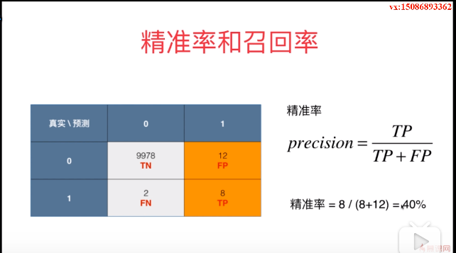
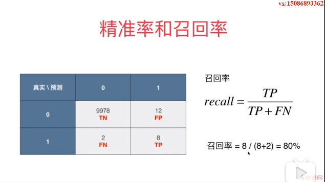

# 分类算法的评价

### 分类准确度

> 存在问题

当数据时极度偏斜(skewed data)数据，只使用分类准确度是不够的。

> 混淆矩阵(confusion matrix)

行代表真实值，列代表预测值。

> f1分数

f1 score是 precision 和 recall 的调和平均值

$$\frac{1}{F1} =  \frac{1}{2}(\frac{1}{precision} + \frac{1}{recall})$$
